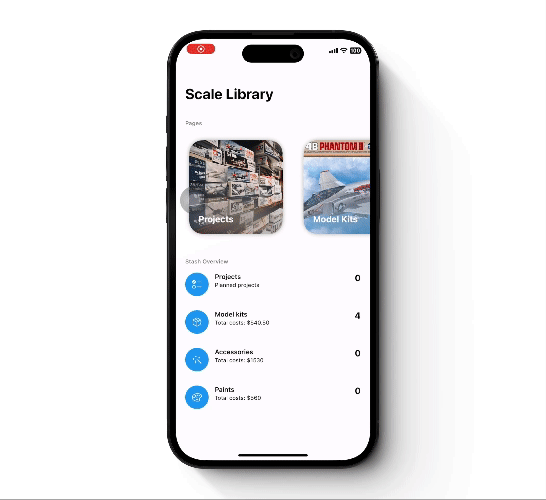
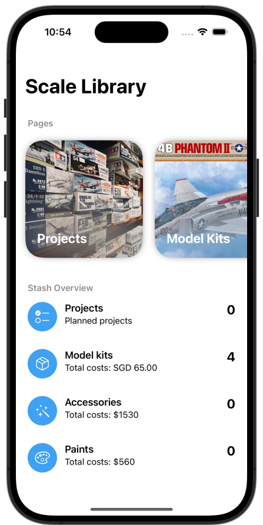
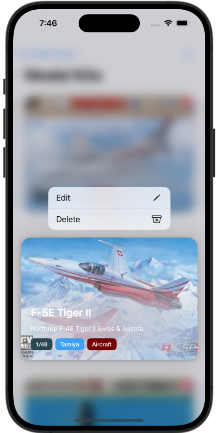

  

  <h1 align="center">Scale Library</h1>

  

    An awesome tracker for your scale modeling journey!
  

## About The Project

  

   

### Overview
Scale Library is an IOS application for scale model enthusiasts to easily manage their model kit collection, keep track of accessories and paints, and plan future projects with a streamlined and intuitive interface.

### Personal objectives
As the first native IOS application that I have built from scratch, here are the main learning objectives that I had given myself for this project.
1. Learn SwiftUI Fundamentals
    - Understand the basic structure of SwiftUI.
    - Familiarise myself with SwiftUI views and modifiers.
    - Understand data flows between views.
    - Data binding and state management.

2. Learn and incorporate the brand new SwiftData
    - Creating SwiftData models and integrating it with SwiftUI.
    - Swift-native predicates.
    - Performing complex operations using ModelContext API directly.

2. Experiment with MVVM in SwiftUI and SwiftData
    - Understand the principles of MVVM architecture.
    - Implement MVVM structure in the project(For better or worse).
    - Comparison between pure SwiftUI + SwiftData and SwiftUI + SwiftData + MVVM.

## Features
This section covers the features that I have implemented so far, as well as the future plans for each of them.

### Home screen:
- Features:
  - Provides access to other pages.
  - Provides an overview of your stash such as total number for each category as well as the amount spent.
- Current limitations:
  - Only model kits page is accessible.
  - Only overview for model kits is available.

  

### Model kits page:
- Features:
  - Displays all the model kits and basic info sorted alphabetically by title.
  - Gridviw is able to make full use of the available screen area by displaying more or less model kits depending on orientation and device(iPhone & iPad).
  - Tapping on a model kit brings you to its detailed page.
  - Activating context menu for a model kit allows quick access to editing and deleting of the model kit.
  - Add button on the toolbar opens a form to add new model kits.
- Current limitations:
  - No search, sorting and filtering available.
  - Context menu borders does not conform to model kit card properly.
  - Animation when deleting a model kit is wonky.

  

### Model kit detailed page:
- Features:
  - Displays all the information about the model kit.
  - Display the project that the model kit was planned for.
  - Menu item allows quick access to editing and deleting of the model kit.
- Current limitations:
  - Unable to view image in fullscreen.
  - Long portrait images causes strange animation behaviour during opening and closing of page.
  - Some information like scale, brand, category and planned project are currently static.

  

## Roadmap
- Add Project, Accessories and Paint pages and their functionality.
- Display some statistics on spendings and number of purchased items using graphs in home screen.
- Privide search, sorting and filtering functions when viewing all projects/model kits/accessories/paints.
- Provide alternatives to gridview, such as list when viewing all projects/model kits/accessories/paints.
