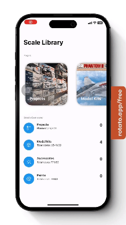

  

  <h1 align="center">Scale Library</h1>

  

    An awesome tracker for your scale modeling journey!
  

## About The Project

  

   

### Overview
Scale Library is an IOS application for scale model enthusiasts to easily manage their model kit collection, keep track of accessories and paints, and plan future projects with a streamlined and intuitive interface.

### Personal objectives
As the first native IOS application that I have built from scratch, here are the main learning objectives that I had given myself for this project.
1. Learn SwiftUI Fundamentals
    - Understand the basic structure of SwiftUI.
    - Familiarise myself with SwiftUI views and modifiers.
    - Understand data flows between views.
    - Data binding and state management.

2. Learn and incorporate SwiftData
    - Creating SwiftData models and integrating it with SwiftUI.
    - Swift-native predicates.
    - Performing complex operations using ModelContext API directly.

2. Experiment with MVVM in SwiftUI and SwiftData
    - Understand the principles of MVVM architecture.
    - Implement MVVM structure in the project(For better or worse).
    - Comparison between pure SwiftUI + SwiftData and SwiftUI + SwiftData + MVVM.

## Features
This section covers the features that I have implemented so far.

### Home screen:
- Access to other pages.
- Provides an overview of your stash such as total number for each category as well as the amount spent.

  

